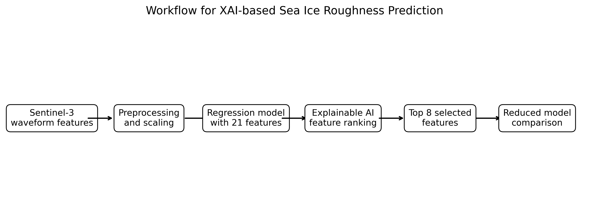
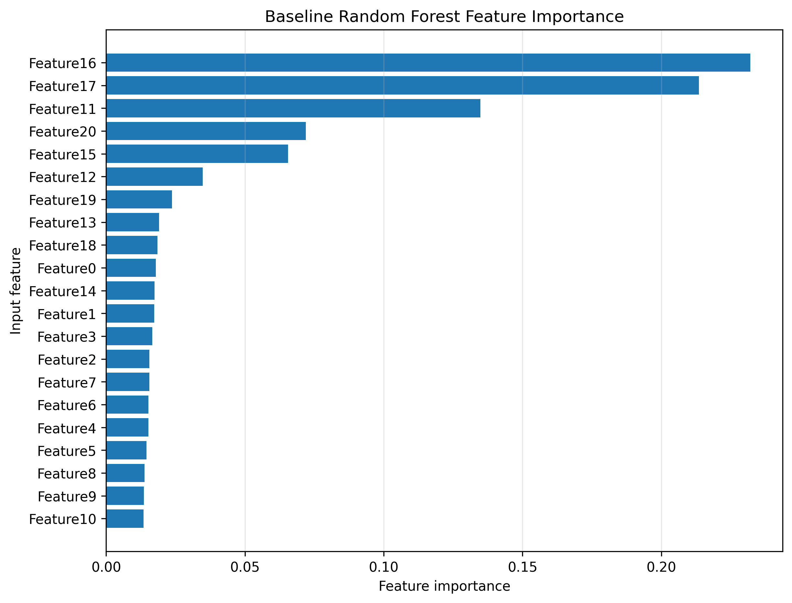
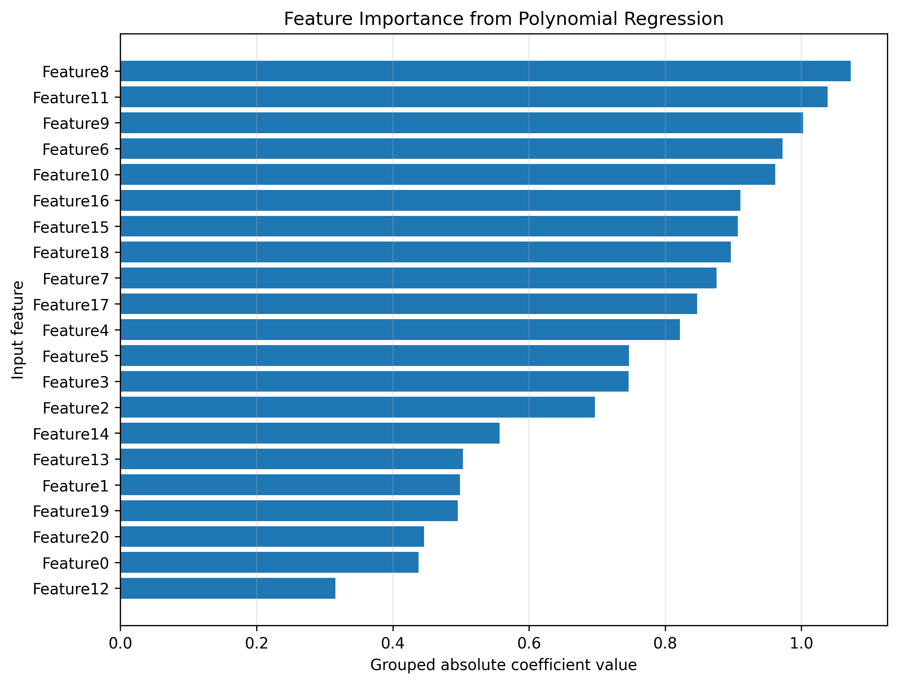
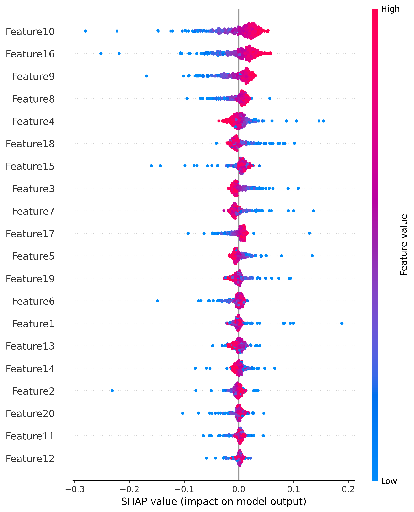
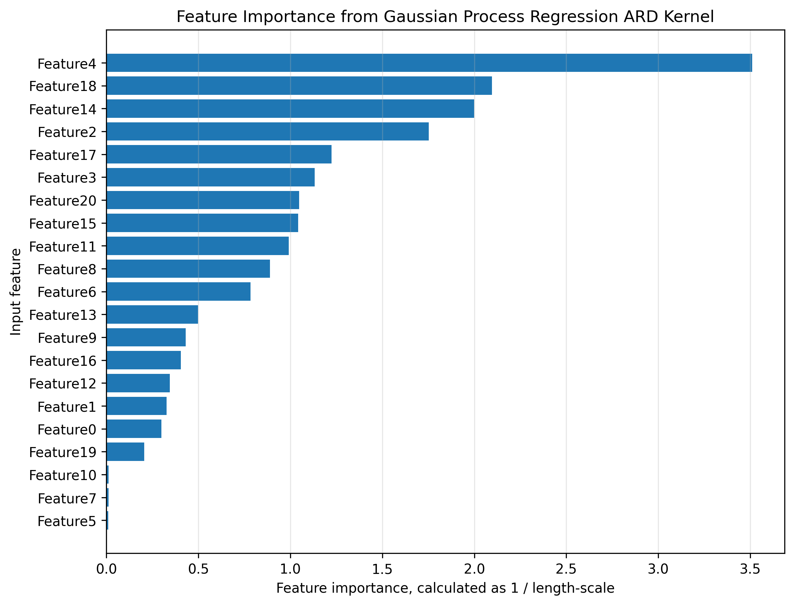
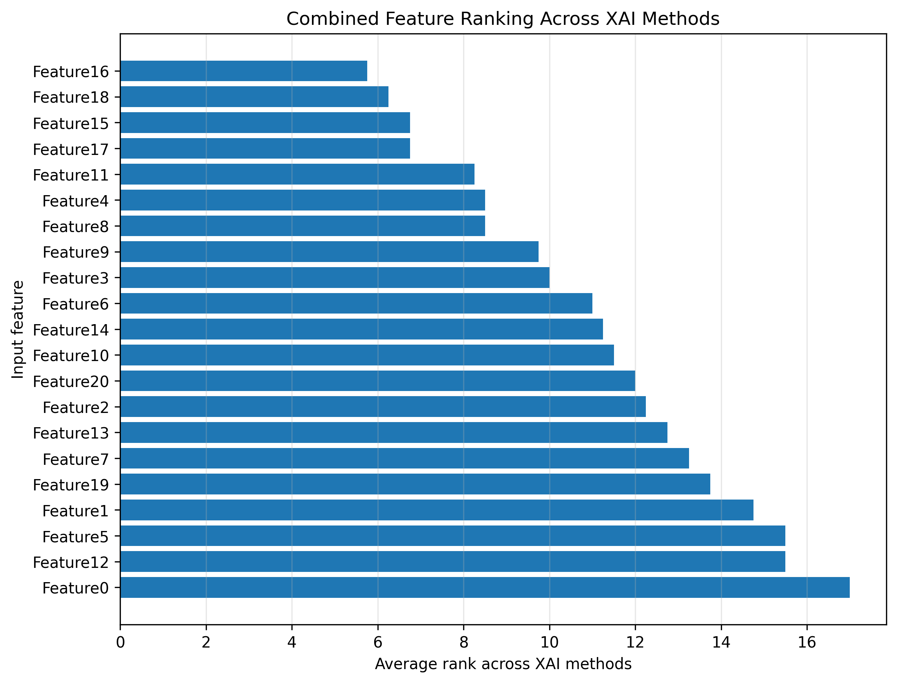
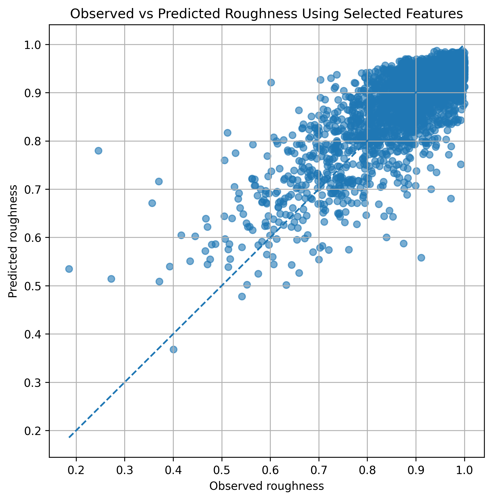
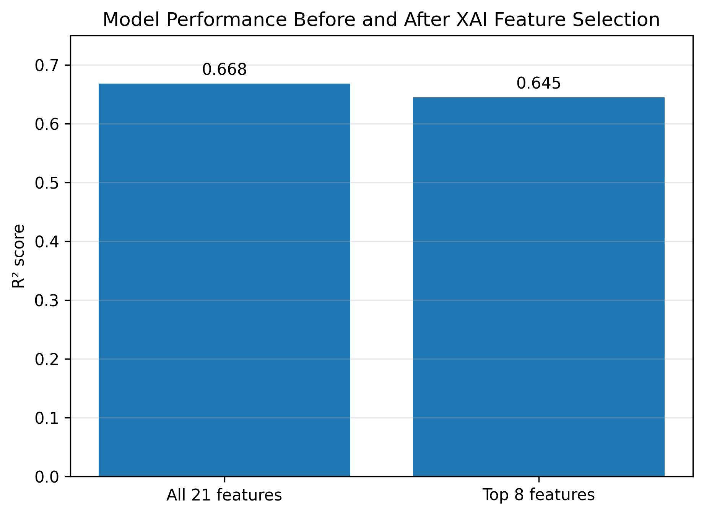

# Explainable AI for Sea Ice Roughness Prediction Using Sentinel-3 Waveform Features

## Table of Contents

- [Project Description](#project-description)
- [Research Question](#research-question)
- [Project Workflow](#project-workflow)
- [Dataset](#dataset)
- [Methods](#methods)
- [Feature Selection](#feature-selection)
- [Reduced Model Using Selected Features](#reduced-model-using-selected-features)
- [Environmental Cost Estimate](#environmental-cost-estimate)
- [Repository Contents](#repository-contents)
- [How to Run the Notebook](#how-to-run-the-notebook)
- [Tutorial Video](#tutorial-video)
- [Limitations](#limitations)
- [Conclusion](#conclusion)
- [References](#references)

## Project Description

This project applies machine learning and explainable AI to predict sea ice roughness using Sentinel-3 waveform-derived input features. The project builds on the regression and explainable AI methods taught in the GEOL0069 Artificial Intelligence for Earth Observation module at University College London.

Sea ice roughness is an important surface property because it affects how sea ice interacts with the atmosphere and ocean. It can also influence melt pond formation, surface drag, and sea ice travel conditions. Sentinel-3 is suitable for this type of Earth Observation problem because the mission measures the Earth's oceans, land, ice and atmosphere using several instruments, including radar altimetry.

The dataset used in this project contains 21 input features. However, not all input features are expected to contribute equally to roughness prediction. The main aim of this project is therefore to test whether explainable AI can identify the most useful input features for predicting sea ice roughness.

The project first trains regression models using all 21 input features. It then compares feature importance using Random Forest feature importance, polynomial regression coefficients, neural network SHAP values, and Gaussian Process ARD length-scales. Finally, a reduced model is trained using only the selected important features and compared with the original full-feature model.

The main contribution of this project is not only predicting roughness, but also testing whether XAI can reduce model complexity by selecting fewer input features while keeping similar predictive performance.

## Research Question

The main research question is:

Can explainable AI identify a smaller set of Sentinel-3 waveform features that can predict sea ice roughness with similar performance to a model using all 21 input features?

The specific objectives are:

1. Train a baseline regression model using all 21 input features.
2. Apply several XAI methods to rank feature importance.
3. Select the most robust important features across different models.
4. Retrain a reduced model using only the selected features.
5. Compare the full-feature and selected-feature models quantitatively.
6. Estimate the environmental cost of running the project.

## Project Workflow

The workflow used in this project is shown below.



*Figure 1: Workflow of the XAI-based sea ice roughness prediction project.*

The workflow starts with Sentinel-3 waveform features. These features are preprocessed and scaled before being used in regression models. Explainable AI methods are then applied to rank the input features. The highest-ranked features are selected and used to train a reduced model. The reduced model is compared against the full-feature model to test whether similar prediction performance can be kept with fewer input variables.

## Dataset

The dataset used in this project contains 14,445 samples and 21 input features. Each sample has one target value representing sea ice roughness. The input feature names in the dataset are generic feature indices, from `Feature0` to `Feature20`.

The data file used in the notebook is:

```python
s3_ML_dataset.npz
```

The notebook expects the data file to contain:

```python
X
y
```

where `X` is the input feature matrix and `y` is the target roughness variable.

The dataset is loaded in the notebook from a Google Drive path. Users who run the notebook should update the dataset path to match their own file location. The raw data file is not redistributed in this repository because it was provided through the GEOL0069 course material.

## Methods

### Baseline model using all features

A Random Forest regression model was first trained using all 21 input features. This model was used as the main baseline because it can model non-linear relationships and gives a stable prediction reference.

The full-feature Random Forest model achieved:

```text
R² = 0.668
RMSE = 0.0554
```

The observed and predicted sea ice roughness values are shown below.


*Figure 2: Observed and predicted roughness values using the full 21-feature Random Forest model.*

### Random Forest feature importance

The Random Forest model was also used to calculate an initial feature importance ranking. This gives a model-based estimate of which input features are most useful for prediction.



*Figure 3: Feature importance ranking from the baseline Random Forest model.*

### Polynomial regression feature importance

A second-degree polynomial regression model with Ridge regularisation was used to estimate feature importance from grouped absolute coefficient values. This method gives another way to test which features have a strong influence in a regression model.



*Figure 4: Feature importance ranking from polynomial regression coefficients.*

### Neural network SHAP values

A neural network regression model was trained using the same 21 input features. SHAP values were then calculated on a subset of the test dataset. SHAP values explain how much each feature contributes to the model prediction for individual samples.



*Figure 5: SHAP summary plot showing the influence of input features on the neural network prediction.*

### Gaussian Process ARD length-scales

Gaussian Process Regression with an automatic relevance determination kernel was also used as an explainable AI method. In an ARD kernel, each input feature has its own length-scale. A smaller length-scale means that the model output is more sensitive to that feature, so the feature is interpreted as more important.

Because Gaussian Process Regression is computationally expensive for large datasets, this part used a representative subset of the training data. The GPR result is therefore used mainly as a feature sensitivity method, rather than as the main prediction model.



*Figure 6: Feature importance ranking from Gaussian Process ARD inverse length-scales.*

## Feature Selection

The feature rankings from the different explainable AI methods were combined using average rank. A lower average rank means that a feature was repeatedly considered important across several models.

The top eight selected features were:

```text
Feature16
Feature18
Feature15
Feature17
Feature11
Feature4
Feature8
Feature9
```

The combined feature ranking is shown below.



*Figure 7: Combined feature ranking across the XAI methods.*

## Reduced Model Using Selected Features

A second Random Forest model was trained using only the eight selected features. This reduced the input dimension from 21 features to 8 features.

The selected-feature model achieved:

```text
R² = 0.645
RMSE = 0.0573
```

### Model Performance Comparison

| Model | Number of Features | R² | RMSE |
|---|---:|---:|---:|
| Random Forest, all features | 21 | 0.668 | 0.0554 |
| Random Forest, selected features | 8 | 0.645 | 0.0573 |

The selected-feature model used about 62% fewer input features, while the R² score only decreased from 0.668 to 0.645.

The observed and predicted values for the selected-feature model are shown below.



*Figure 8: Observed and predicted roughness values using only the selected eight features.*

The comparison between the full-feature and selected-feature models is shown below.



*Figure 9: R² comparison between the full-feature and selected-feature Random Forest models.*

The selected-feature model has a slightly lower R² score than the full-feature model, but the decrease is small. The number of input features was reduced from 21 to 8, which is a reduction of about 62%. This suggests that the selected features retained most of the useful predictive information while making the model simpler.

## Environmental Cost Estimate

The environmental cost of this project was estimated from the approximate Google Colab runtime, compute power, data storage and saved outputs.

### Computational Footprint

| Item | Estimate |
|---|---:|
| Estimated Colab runtime | 3.0 hours |
| Average compute power | 50 W |
| Estimated energy use | 0.180 kWh |
| Estimated carbon footprint | 0.072 kg CO2e |
| Input dataset size | 1.27 MB |
| Saved figures size | 2.54 MB |

This is a small footprint compared with large-scale AI model training, but it is still not zero. The main sources of environmental cost are repeated Colab computation, cloud storage, and saved outputs.

Several choices were used to reduce unnecessary computation. Gaussian Process Regression was trained on a subset of the data, SHAP explanation was calculated on a smaller sample, and only final figures were saved. The notebook also avoids repeated large data downloads. Idle Colab sessions should also be disconnected after the notebook has finished running.

## Repository Contents

```text
README.md
Main project description and summary of results.

GEOL0069_Final_Project_XAI_Sea_Ice_Roughness_23001986.ipynb
Main Google Colab notebook containing the full analysis.

figures/
Final figures generated by the notebook.

outputs/
CSV files containing model performance, feature rankings, selected features and environmental cost estimate.
```

## How to Run the Notebook

1. Open the notebook in Google Colab.
2. Mount Google Drive.
3. Update the dataset path to the location of `s3_ML_dataset.npz`.
4. Run the notebook from top to bottom.
5. The figures will be saved into the `figures` folder.
6. The output CSV files will be saved into the `outputs` folder.

## Tutorial Video

A short video explaining the code and workflow is available here:

https://youtu.be/AI3aS-TGEQA

## Limitations

The main limitation is that the input features are labelled using generic names, such as `Feature0` to `Feature20`. This means that the XAI results can identify which input columns are important, but the physical interpretation of each feature depends on the original dataset documentation.

A second limitation is that Gaussian Process Regression was trained on a subset of the data because full Gaussian Process Regression is computationally expensive. Therefore, the GPR result is used mainly as an interpretation method, rather than as the main predictive model.

The neural network and SHAP analysis were also calculated with a limited sample size to keep the notebook suitable for Google Colab. A larger experiment could test whether the same selected features remain important across different random seeds, larger SHAP samples, and different train-test splits.

## Conclusion

The full-feature Random Forest model predicted sea ice roughness with an R² score of about 0.668. After combining feature rankings from Random Forest importance, polynomial regression coefficients, neural network SHAP values, and Gaussian Process ARD length-scales, the top eight features were selected. The reduced Random Forest model using only these eight features achieved an R² score of about 0.645.

This shows that explainable AI can reduce the number of input features while keeping a similar level of prediction performance. In this project, the input dimension was reduced by about 62%, from 21 features to 8 features, with only a small decrease in model performance.

## References

Breiman, L. (2001). Random forests. Machine Learning, 45, 5–32. https://doi.org/10.1023/A:1010933404324

European Space Agency. (n.d.). Sentinel-3. ESA. https://www.esa.int/Applications/Observing_the_Earth/Copernicus/Sentinel-3

Johnson, T., Tsamados, M., Muller, J.-P., & Stroeve, J. (2022). Mapping Arctic sea-ice surface roughness with Multi-Angle Imaging SpectroRadiometer. Remote Sensing, 14(24), 6249. https://doi.org/10.3390/rs14246249

Lundberg, S. M., & Lee, S.-I. (2017). A unified approach to interpreting model predictions. Advances in Neural Information Processing Systems, 30. https://arxiv.org/abs/1705.07874

Rasmussen, C. E., & Williams, C. K. I. (2006). Gaussian Processes for Machine Learning. MIT Press. https://gaussianprocess.org/gpml/
